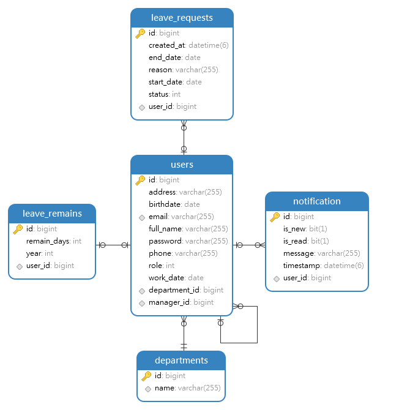

### A Spring Boot REST API project that manages employee day offs.

#### Swagger URL: `http://13.215.172.112:8080/swagger-ui/index.html`

#### Database console: `http://13.215.172.112:8080/h2-console`

- Driver Class: `org.h2.Driver`
- JDBC URL: `jdbc:h2:mem:dacnpm`
- User Name: `sa`
- Password:

#### Database Schema

`role`

- 0 - Manager
- 1 - Admin
- 2 - User

`status`

- 0 - Accepted
- 1 - Rejected
- 2 - Waiting